# Documento Técnico de Arquitectura de datos escalable para FarmIA

**Autor:** Carlos Barros  
**Fecha:** Mayo 2026
**GitHub**: [Link](https://github.com/cbarros7/farmia-data-lakehouse)

## 1. Resumen ejecutivo y restricciones físicas

La arquitectura para soportar la proyección de FarmIA ha sido diseñada para ingerir, procesar y servir telemetría IoT, transacciones de ventas y datos meteorológicos. El objetivo es escalar para triplicar su volumen en dos años, operando bajo las restricciones de una infraestructura inicial de bajo costo (Azure Students). Para evadir los límites físicos de red (2 MB/s en Event Hubs) y los posibles colapsos por falta de RAM en Databricks, se ha implementado un patrón de captura directa hacia Azure Data Lake Storage (ADLS Gen2). Para asegurar la eficiencia algorítmica de la plataforma, el sistema se apoya en contratos estrictos, un procesamiento mediante micro-lotes espaciados y persistencia sobre Delta Lake.

A continuacion se muestra el blueprint de arquitectura de datos de FarmIA. *(Nota: Si bien en este diagrama se expresan las capas *GOLD* y de *CONSUMO*, se han incluido únicamente como muestra de que la visión del proyecto es avanzar hasta instancias de visualización y Business Intelligence en futuras iteraciones, aunque estas no formen parte de la implementación inicial. Ver sesión 3.5 para mayor información).* 

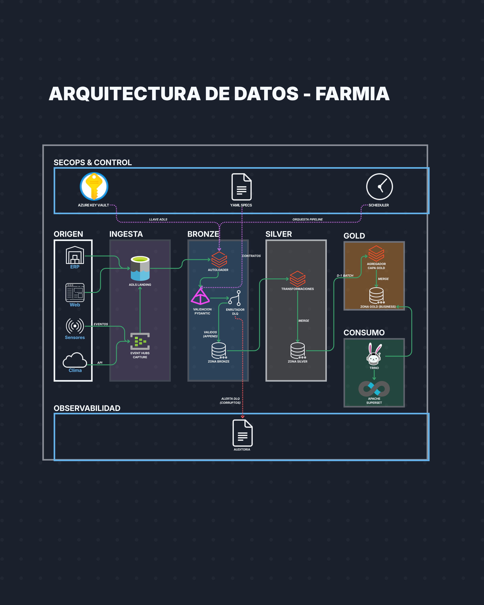

## 2. Orígenes de datos

Para el desarrollo de esta arquitectura, se han identificado cuatro fuentes fundamentales que alimentarán el motor de ingesta. Cada una posee una naturaleza técnica distinta:

*   **Ventas online:** Información transaccional de la plataforma de comercio electrónico, esencial para el análisis de demanda.
*   **Registros de inventario:** Datos de existencias y movimientos de stock provenientes del sistema de gestión local (ERP).
*   **Sensores IoT:** Telemetría recolectada en campo que monitorea variables de temperatura, humedad y calidad del suelo.
*   **Información meteorológica externa:** Datos climáticos de terceros utilizados para la predicción de cosechas y la optimización de la logística.

A continuación se observa una captura que evidencia la ingesta de telemetría IoT a través de Event Hubs:

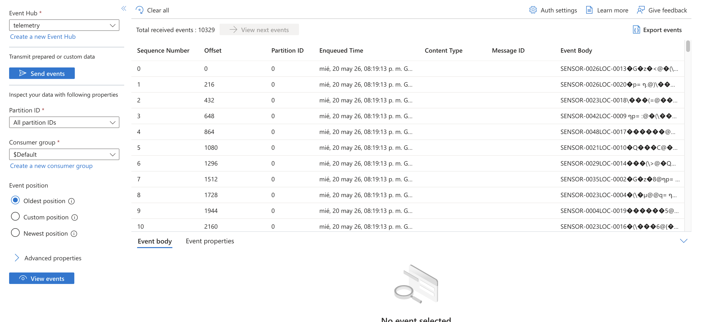

## 3. Diseño arquitectónico, patrones y decisiones fundamentadas

### 3.1 Estándares de metadatos para linaje y auditoría profunda

Para garantizar la reproducibilidad y el gobierno del dato, cada registro inyectado en el sistema heredará un esquema de metadatos técnicos obligatorio. Este estándar permite rastrear no solo el origen, sino el estado exacto de la infraestructura y el código en el momento del procesamiento:

*   **Linaje y sincronización:** `_source_system`, `_file_path`, `_batch_id`, `_event_timestamp` e `_ingest_timestamp`.
*   **Gobernanza de esquemas y código:** `_schema_version_id` (versión del contrato en el Registry) y `_pipeline_git_hash` (versión exacta de la lógica de transformación).
*   **Auditoría de entorno:** `_execution_user_id`, `_environment_id`, `_cluster_id` y `_processing_library_version`.
*   **Ciclo de vida y operación:** `_operation_type` (naturaleza del cambio CDC) y `_retention_ttl` (política de purga automática).

### 3.2 Motor de ingesta y plano de control (Capa Landing a Bronze)

El motor central abandona los acoplamientos rígidos en favor de un patrón **Metadata-Driven Pipes and Filters** (Richards & Ford, 2020, pp. 143-144).

*   **Desacoplamiento operativo:** La ingesta bruta se realiza volcando AVRO (IoT), PARQUET (Ventas) y JSON (Clima) directamente en almacenamiento de objetos. Esto mitiga los cuellos de botella y previene la vulnerabilidad de fallos en cascada, algo muy característico de los sistemas fuertemente acoplados (Reis & Housley, 2022, pp. 79-81). Asimismo, se delega la lectura a Databricks Auto Loader mediante el patrón *Incremental Loader*, lo que minimiza drásticamente el consumo de I/O (Konieczny, 2025, p. 12).
*   **Gestión del plano de control:** Las configuraciones se definen en archivos YAML almacenados directamente en ADLS, otorgando al negocio una alta agilidad para realizar modificaciones.
*   **Fail-Fast y validación en Runtime:** Para mitigar el riesgo de errores humanos al editar el YAML, la "Tarea 0" del *job* de Spark ejecuta modelos estrictos utilizando **Pydantic**. Si el sistema detecta un error de esquema o una dependencia lógica rota en el contrato, emite un *fail-fast* en cuestión de milisegundos. Esto aborta la ejecución antes de aprovisionar infraestructura pesada y gastar créditos (DBUs).
*   **Aislamiento por Cuantos Arquitectónicos:** El motor genérico se despliega instanciando micro-lotes independientes para Ventas, Clima e IoT. Se entiende un **cuanto arquitectónico** (*architectural quantum*) como un artefacto desplegable independientemente, con alta cohesión funcional y un acoplamiento estático (Ford et al., 2022; Richards & Ford, 2020, p. 92). De esta manera, si un dominio falla, el radio de explosión se contiene y se protege el resto de los flujos.

Para ilustrar la implementación de este motor, se presentan las siguientes evidencias. Primero, las zonas de almacenamiento configuradas en Azure Storage:

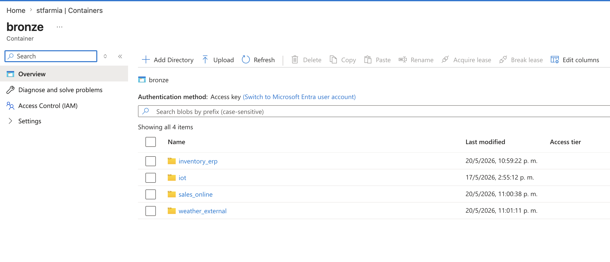

Segundo, la orquestación del Job de generación de datos en Databricks:

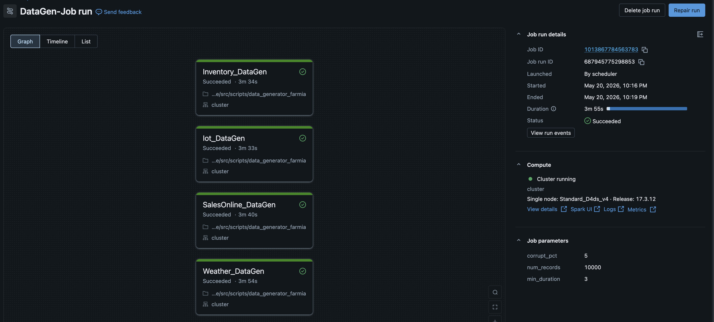

Flujo de tareas del Job de ingesta: obsérvese que primero se ejecuta exitosamente la tarea de validación de Pydantic antes de procesar los datos:
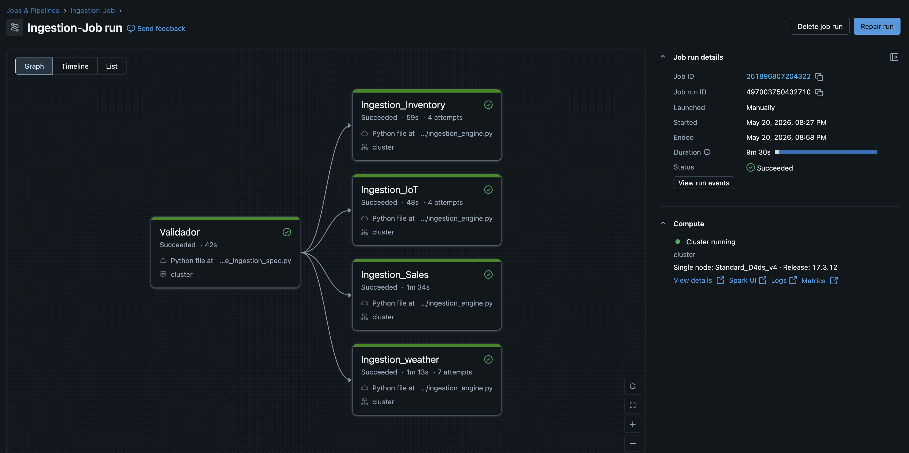

Y tercero, un ejemplo de la validación *Fail-Fast* en ejecución mediante Pydantic detectando errores en el contrato:

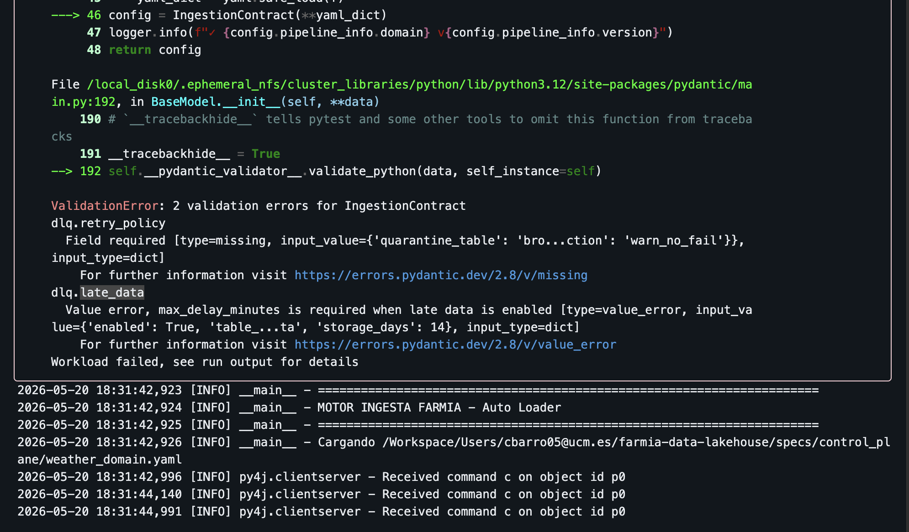

*En esta imagen se observa la interrupción inmediata del Job de Spark (Fail-Fast) debido a que Pydantic detectó la ausencia del campo obligatorio `quarantine_table` en el contrato YAML. Esto aborta la ejecución en milisegundos, previniendo fallos en cascada y ahorrando costos computacionales.*

### 3.3 Data plane y gestión de estado (Frontera de transición Bronze-Silver)

El procesamiento en Spark impone restricciones severas para evitar el antipatrón del doble cómputo en la red y en las transferencias; así, se asumen los costos de lectura y deserialización una única vez (Konieczny, 2025, p. 182). Además, evitamos el colapso de los clústeres efímeros forzando un manejo de memoria explícito con **MEMORY_AND_DISK**. Esto garantiza que el sistema pueda volcar información al disco local si se agota la memoria RAM durante picos masivos de datos (Kleppmann, 2017, pp. 52-54).

*   **Patrón Parallel Split y aislamiento de fallos:** Al iterar con *foreachBatch*, el lote se procesa en memoria actuando como un enrutador de calidad. El flujo se bifurca de manera simultánea en registros válidos (que se promueven a la capa **Silver**) y registros en cuarentena (que se retienen en el nivel **Bronze/DLQ**). Ambas escrituras son transaccionalmente independientes. Si la cuarentena falla por un problema de red, la librería **tenacity** ejecuta un reintento con retroceso exponencial, sin obligar a realizar un *rollback* de los datos sanos. Esto asegura el aislamiento del dominio de fallo y mantiene la alta disponibilidad (Ford, Richards, Sadalage, & Dehghani, 2022, pp. 260-261; Richards & Ford, 2020, p. 61).
*   **Deduplicación y Watermarking:** Dado que Event Hubs garantiza entrega *at-least-once*, se inyecta un *Watermark* de estado en memoria limitado estrictamente a 30 minutos. Los eventos que superen este retraso se desvían a una tabla de "Late Data". Esto previene la saturación de RAM en la ventana de procesamiento y protege el desempeño algorítmico al gestionar la latencia (Urquhart, 2020, pp. 119-120).
*   **Estrategia de Idempotencia dinámica:** A través del archivo YAML, el sistema orquesta el patrón estrategia (*Strategy Pattern*) del motor. Esto significa que se aplica un **MERGE INTO** (Upsert) pesado y consistente para Ventas e Inventario, preservando así la integridad transaccional. En contraste, se utiliza un **APPEND** ligero para la telemetría IoT y el clima, lo que alivia significativamente la contención de los recursos computacionales (Ford et al., 2022, pp. 262-263).
*   **Operabilidad sin Fail-Fast:** En caso de que una avalancha de datos provoque un *spill* al disco y ralentice el sistema, un *Watchdog* asíncrono emitirá alertas al superar la marca de los 45 minutos, pero permitirá que el clúster termine su procesamiento. No se sacrifica la disponibilidad ante la degradación temporal, aplicando principios de *enmascaramiento de excepciones* para evitar que errores tolerables interrumpan el flujo principal (Ousterhout, 2018, p. 83)

Como evidencia de la correcta transición y gestión del estado en la capa **Silver**, se muestra el catálogo de datos estructurado en Databricks:

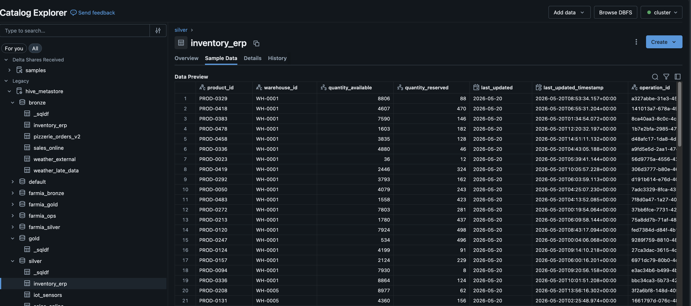

### 3.4 Evolución de esquemas y tolerancia a fallos (Schema Drift & DLQ)

Para evitar que FarmIA se convierta en un pantano de datos, el sistema implementa una gobernanza defensiva:

*   **Contratos estrictos (Strict Contracts):** Se desactiva la evolución automática de esquemas en el flujo principal (`schemaEvolutionMode = "none"`). Los registros mutados son dirigidos a la cuarentena. Si se detecta la ausencia de columnas obligatorias, se dispara una alerta crítica que indica la ruptura del contrato de datos. Esta medida evita que el productor de datos comprometa el sistema enviando formatos incorrectos, salvaguardando la calidad de la información que ingresa al Data Lake (Ford, Parsons, Kua, & Sadalage, 2023).
*   **Rescate de datos (`_rescued_data`):** Ningún dato omitido o nuevo en el origen se descarta. Toda la información extra se inyecta y estructura dentro de una columna JSON para que los analistas de datos puedan evaluarla posteriormente.
*   **Circuit Breaker y enmascaramiento de excepciones:** Si más del 5% del lote ingresa a la DLQ, el sistema entra en un "Estado de degradación", enviando la basura a la DLQ pero permitiendo que el flujo principal de datos sanos continúe. Para evitar la *fatiga de alertas*, el sistema realiza un *Exception Masking* gestionando el estado en una tabla ligera (`system.alert_logs`), silenciando las notificaciones humanas por 4 horas si el error persiste.

### 3.5 Consumo federado y Zero-ETL (Capa Gold)

> [!NOTE]
> **Aclaración sobre el alcance inicial:** Es importante destacar que el desarrollo e implementación de la capa **GOLD**, así como la configuración operativa del motor **Trino** y la capa de visualización (**Apache Superset**), **no fueron implementados en esta primera fase del proyecto**. Todo lo descrito en esta sección corresponde **exclusivamente a la fase de diseño arquitectónico** (sin implementación real en el código). La idea es establecer las bases conceptuales para avanzar y robustecer la plataforma integrando estos componentes analíticos en futuras iteraciones.

El diseño conceptual separa las cargas transaccionales operacionales de las analíticas para seguir los principios *FinOps* y proteger el consumo de CPU de la capa analítica. Para atender la demanda futura de analítica y *business intelligence*, el diseño proyecta integrar el motor **Trino** conectado de manera directa al lago de datos, operando bajo un enfoque libre de extracción y carga (Zero-ETL). **Aunque la capa de visualización (Trino y Superset) y la capa Gold no representan el núcleo de esta entrega inicial, su inclusión en el diseño responde a la necesidad de demostrar cómo se escalará la arquitectura tecnológica usando UniForm.** Esta proyección sirve como validación del motor de ingesta construido, evidenciando por qué se decidió integrar metadatos de Iceberg desde el inicio: garantizar que los datos curados sean accesibles de forma universal sin duplicidad física.

*   **Pre-agregación en Silver:** Todo el trabajo pesado se ejecuta en Spark (Capa Silver). Como resultado, Trino nunca tiene que escanear miles de millones de filas a nivel granular.
*   **Modelado híbrido y Ciclo de Vida específico por dominio:** La capa **Gold** utiliza un modelo dimensional **Star Schema** (consistencia ACID) para dominios operacionales como Ventas e Inventario. Esto separa de forma semántica los datos en hechos y dimensiones, simplificando la lógica de negocio y acelerando las agregaciones (Ford, Richards, Sadalage, & Dehghani, 2022). Paralelamente, se emplea un **One-Big-Table (OBT)** desnormalizado para telemetría *IoT* y *clima*, optimizando los escaneos secuenciales masivos.

Cabe recalcar que las políticas de gestión del ciclo de vida son aplicadas de manera asimétrica. Exclusivamente para la *telemetría de sensores (IoT)* y el *clima*, el sistema implementa una política estricta de retención (TTL) sobre los registros granulares, limitando su existencia a un máximo de **14 días** para garantizar la eficiencia computacional y adherirse a la característica arquitectónica de *Archivability* o eliminación controlada (Richards & Ford, 2020, p. 71).

Antes de realizar la purga física de esta ventana de tiempo en estos dominios masivos, el motor orquesta un proceso de pre-agregación (ej. *roll-ups* de promedios, máximos y mínimos diarios), consolidando los datos en resúmenes históricos persistentes. Esta táctica, formalizada dentro del contrato de datos de dichos dominios, evita el crecimiento infinito del almacenamiento y previene la degradación del rendimiento analítico a largo plazo (Tune & Perrin, 2024, p. 351).

*   **Sincronización D-1 y consistencia eventual:** Al acordar que el *dashboard* analítico opere con datos consolidados hasta el día anterior (D-1), logramos que el clúster de Trino y el exportador de metadatos se enciendan únicamente durante la ventana nocturna, utilizando el patrón de sincronización asíncrona por lotes (*Background Batch Synchronization*) (Ford et al., 2022).
*   **Patrón Proxy con Delta UniForm:** Spark escribe los datos en formato Delta Lake, pero UniForm expone los metadatos asíncronamente en formato Apache Iceberg, logrando acceso universal sin realizar operaciones adicionales de copiado (Zero-ETL).

## Referencias

*   Ford, N., Parsons, R., Kua, P., & Sadalage, P. (2023). *Building Evolutionary Architectures: Automated Software Governance* (2nd ed.). O'Reilly Media.
*   Ford, N., Richards, M., Sadalage, P., & Dehghani, Z. (2022). *Software Architecture: The Hard Parts*. O'Reilly Media.
*   Kleppmann, M. (2017). *Designing Data-Intensive Applications: The Big Ideas Behind Reliable, Scalable, and Maintainable Systems*. O'Reilly Media.
*   Konieczny, B. (2025). *Data Engineering Design Patterns: Recipes for Solving the Most Common Data Engineering Problems*. O'Reilly Media.
*   Ousterhout, J. (2018). *A Philosophy of Software Design*. Yaknyam Press.
*   Reis, J., & Housley, M. (2022). *Fundamentals of Data Engineering*. O'Reilly Media.
*   Richards, M., & Ford, N. (2020). *Fundamentals of Software Architecture: An Engineering Approach*. O'Reilly Media.
*   Tune, N., & Perrin, J.-G. (2024). *Architecture Modernization: Socio-technical alignment of software, strategy, and structure*. O'Reilly Media.
*   Urquhart, J. (2020). *Flow Architectures: The Future of Streaming and Event-Driven Integration*. O'Reilly Media.

## Anexo: Evidencias adicionales

A continuación se adjuntan capturas complementarias de la infraestructura y catálogos de datos:

**1. Contenedores del Data Lake en Azure Storage:**
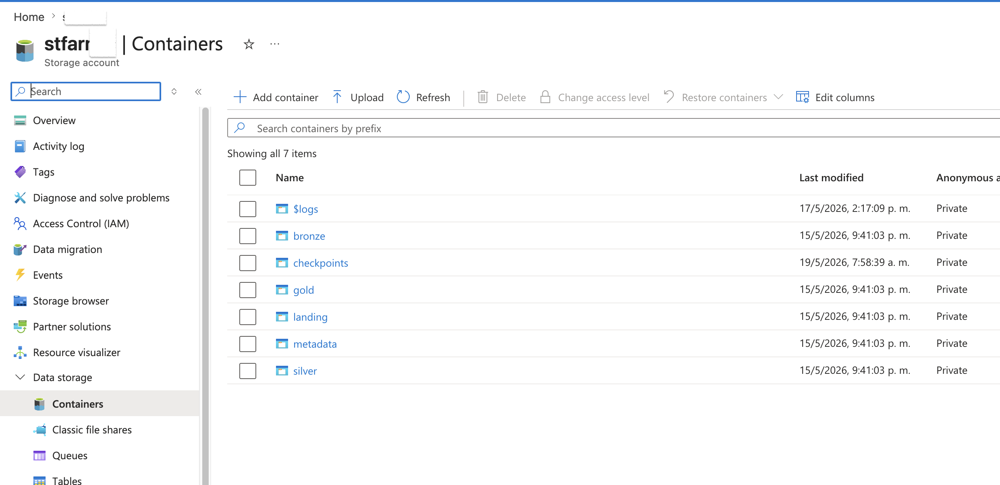

**2. Catálogo de Datos Bronze (Datos Tardíos de Clima):**
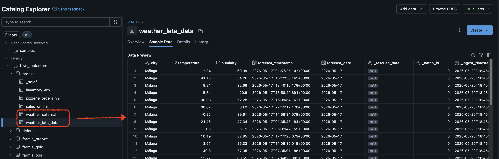

**3. Catálogo de Datos Silver (Ventas Online):**
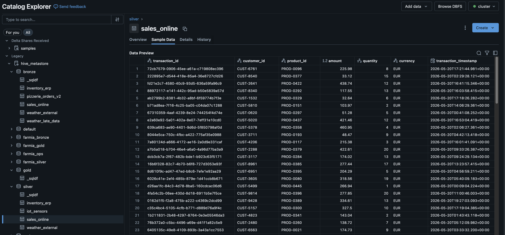

**4. Event Hubs - Telemetria - Mensajes Recibidos :**
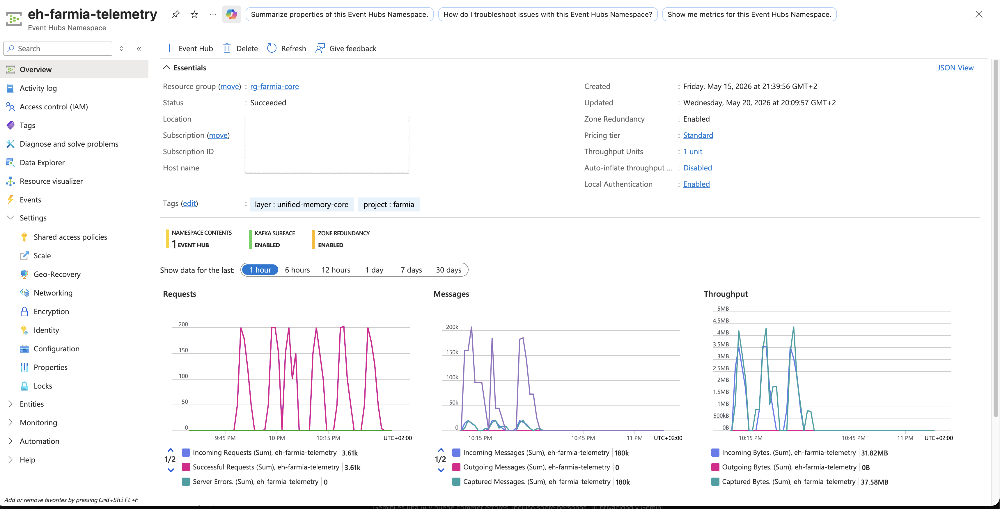
